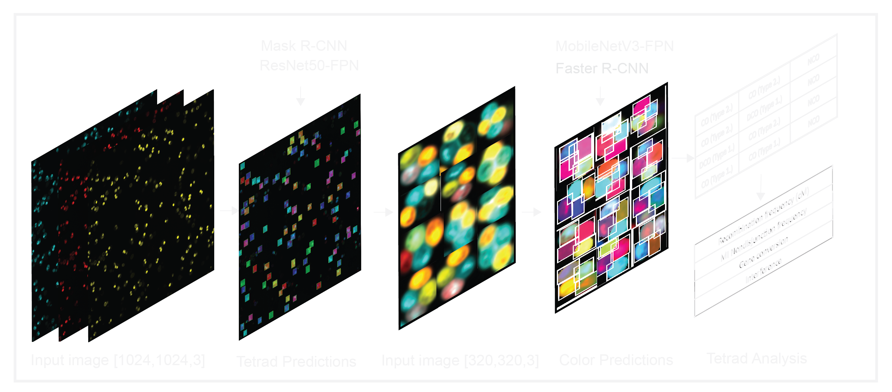

# TetradDetection

## Description
High-throughout _S.cerevisiae_ tetrad image analysis pipeline. The pipeline relies on two deeplearning models for accurate detection of tetrads and triads followed by subsequent classification into corresponding tetrad types based on recombination (non-crossover, crossover). The pipeline takes input fluorescent images (mCerulean, tdTomato, YFP) and outputs calculated map distance, interference, non-dicjuntion and gene-conversion frequencies in an .xlsx file.



## Installation

### 1. Install Anaconda
[Download an Anaconda distribution](https://www.anaconda.com/download)

### 2. Create a virtual environment and activate it
```python
conda create -n TetradDetection
conda activate TetradDetection
```

### 3. Install TetradDetection in Windows
```python
conda install -c LisbyLab TetradDetection
pip install TetradDetection
```

### 4. Install modules using requirements.txt
```python
pip install requirements.txt
```

### 5. Download weight files for the neural network and place them in the weights folder

## Usage
### Prerequisites
1. You should install CUDA-enabled GPU cards or alternatively CPU.
2. Single-channel grayscale fluorescent images captured at 60x magnification with a 425 nm laser (mCerulean), 561 nm laser (tdTomato) and 488 nm laser (YFP).


