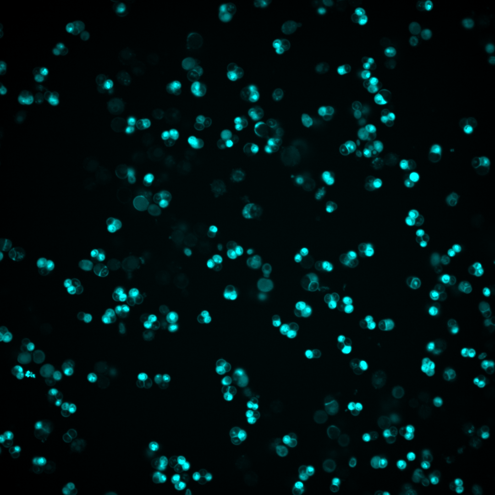

# TetradDetection

## Description
High-throughout _S.cerevisiae_ tetrad image analysis pipeline. The pipeline relies on two deeplearning models for accurate detection of tetrads and triads followed by subsequent classification into corresponding tetrad types based on recombination (non-crossover, crossover). The pipeline takes input fluorescent images (mCerulean, tdTomato, YFP) and outputs calculated map distance, interference, non-discjuntion and gene-conversion frequencies in an .xlsx file.


## Installation

### 1. Install Anaconda
[Download an Anaconda distribution](https://www.anaconda.com/download)

### 2. Create a virtual environment and activate it
```python
conda create -n TetradDetection
conda activate TetradDetection
```

### 3. Install TetradDetection in Windows
```python
pip install git+https://github.com/Lisby-Lab/TetradDetection.git
```

### 4. Install modules using requirements.txt
```python
pip install -r requirements.txt
```

### 5. Download weight files for the neural network and place them in the weights folder
[Tetrad Prediction weights](https://sid.erda.dk/share_redirect/DdA5m0BYct)
[Color Classification weights]
## Usage
### Prerequisites
1. Standard computer with enough RAM to apply the neural networks. 8 GB RAM is enough to predict the 1080 x 1080 px image provided as the test data. The RAM requirements scale with the number of image pixels.
2. Single-channel grayscale fluorescent .tiff/.tif images captured at 60x magnification with a 425 nm laser (mCerulean), 561 nm laser (tdTomato) and 488 nm laser (YFP).
3. Images must be named following these guidelines, where the identifier indicates the sequential order of the image. Specifically, the identifier denotes the position of the image in the sequence: e.g., the first image would have an identifier of 1, the second image an identifier of 2, the third image an identifier of 3, and so on. Image Name can be changed according to preference. The suffix indicates which fluorescent channel the image belongs to.
   
| Name      | Identifier | Suffix | Example Filename       |
|-----------|------------|--------|------------------------|
| mCerulean | \_1\_     | \_1    | mCerulean_1_1.png      |
| tdTomato  | \_1\_     | \_2    | tdTomato_1_2.png       |
| YFP       | \_1\_     | \_3    | YFP_1_3.png            |


<table border="0">
  <tr>
    <td></td>
    <td></td>
    <td></td>
  </tr>
</table>

4. Within the TetradDetection environment open a new Terminal and write type in:
```python
python3 entry.py --path ./classification/
```
5. After the program finishes a new default.xlsx file will be created on the root folder containing calculated Map Distance, Interference, Non-Disjunction and Gene Conversion frequency values.


## Support
Please contact bszucs@sund.ku.dk and raghav@di.ku.dk if you have any questions about DeepTetrad.


